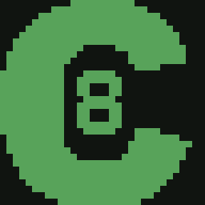
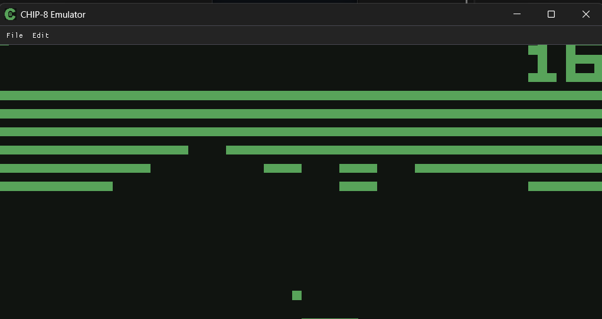
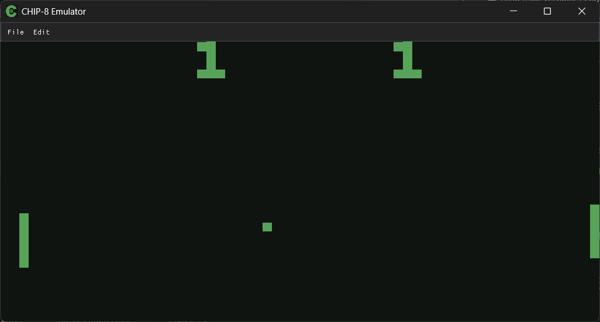

<div id="user-content-toc">
  <ul align="center" style="list-style: none;">
    <summary>
      <h1>Chip-8 Emulator</h1>
      
    </summary>
  </ul>
</div>

A C++ Chip-8 emulator

## Installation & Running
1. Download the latest release [here](https://github.com/ByteLabDev/Chip8-Emulator/releases/latest).
2. Extract the folder, open chip8/chip8.exe
3. Navigate to the menu bar: **File > Load ROM**
    - Select any `.ch8`, `.rom`, or `.bin` file to start.

> [!TIP]
> You can find Chip-8 ROMs [here](https://github.com/kripod/chip8-roms).

> [!TIP]
> Some ROMs use higher resolution displays. The output resolution can be toggled between 64x32 and 128x64 in the Edit menu.

<p align="center">
   
  
</p>

## Building
### Clone the repo
```
git clone https://github.com/ByteLabDev/Chip8-Emulator.git
cd Chip8-Emulator
```

### Configure and Build
```
cmake -B build
cmake --build build --config Release
```

## Tech Stack
- Language: C++
- Libraries: SDL3, Dear ImGui

## Controls
> [!TIP]
> Most Chip-8 games use 2, 4, 6, and 8 for movement and 5 or 7 for primary actions.

| Original Key | Keyboard Binding |
|-------------|-------------|
1 2 3 C | 1 2 3 4 |
4 5 6 D | Q W E R |
7 8 9 E | A S D F |
A 0 B F | Z X C V |

# License

